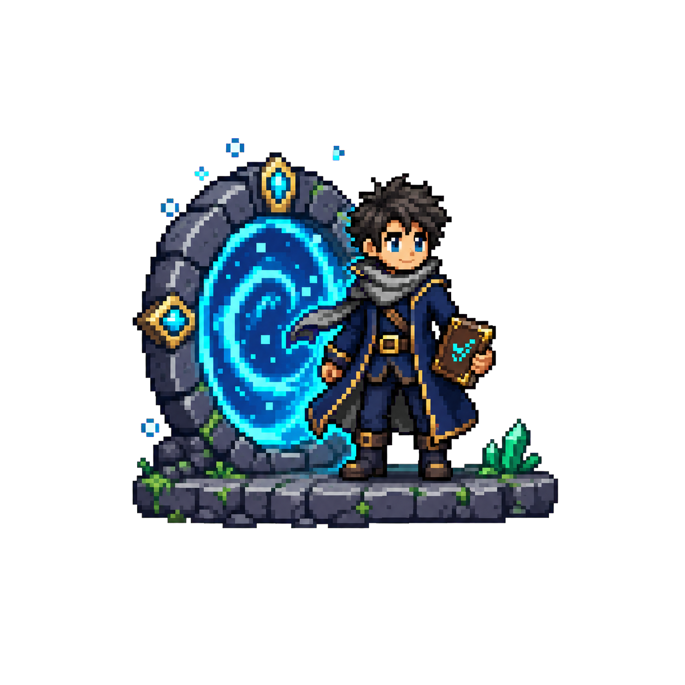
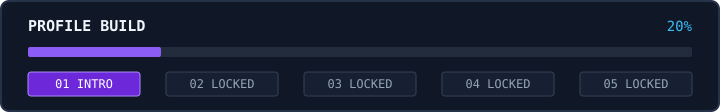

<div align="center">



# Hi, I'm Afgan.

**Web Developer**

I build practical web experiences with clean interfaces and reliable flows.

`PLAYER 01` &nbsp; • &nbsp; `INDONESIA` &nbsp; • &nbsp; `STAGE 1 / 5`

</div>

<br>

<div align="center">



</div>

### `> realm_status`

```text
PIXEL INTRODUCTION .................................. UNLOCKED
PLAYER PROFILE + INVENTORY .......................... LOCKED
QUEST BOARD ......................................... LOCKED
CONTRIBUTION ARCADE ................................. LOCKED
CONTACT + FINAL POLISH .............................. LOCKED
```

### `> current_save`

The first portal is open. This profile will grow one stage at a time.

<div align="center">

**Next unlock:** Player Profile + Technology Inventory

<sub>Original pixel artwork created for Afgan's GitHub profile.</sub>

</div>
